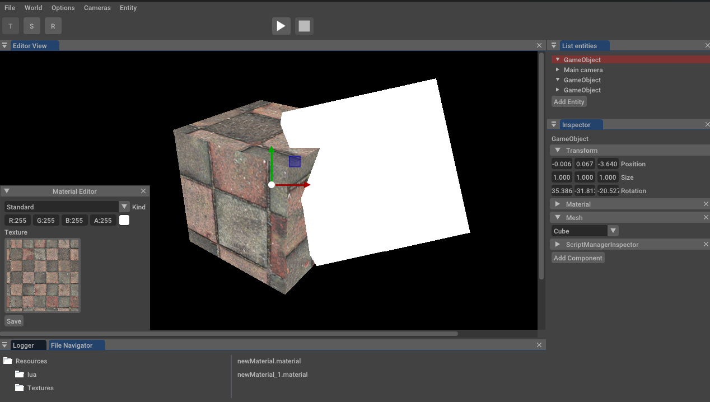
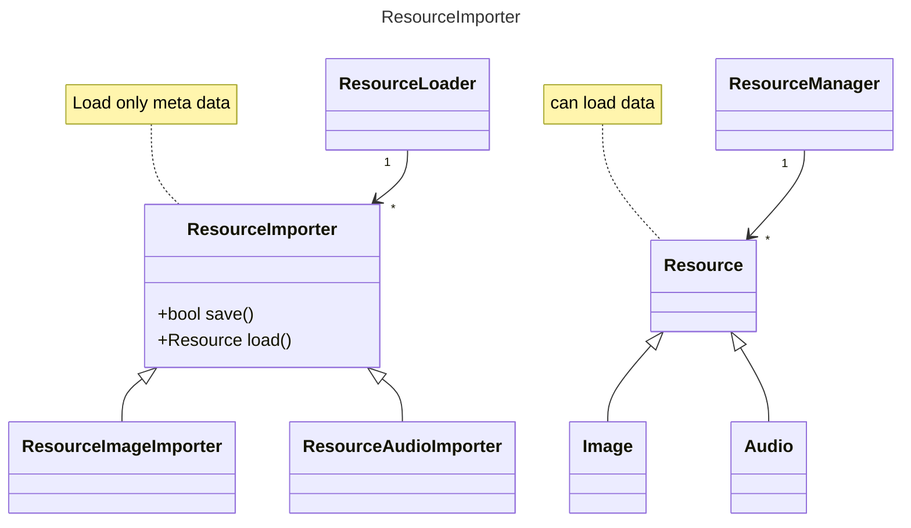

# FarenEngine

### Introduction
This library enables to create 2D or 3D games with lua scripts. The engine is linked to an entity system component.
The image below show the possibilities of the library.



FarenEngine features:
+ Camera system 
+ Display simple textured shapes
+ Sound
+ Physics
+ Lua scripting
+ Forward
+ Light effects (basic)
+ Serialization system
+ Multiple scenes

### Installation

To install the whole project:

* Clone the project with
git clone https://github.com/F4r3n/FarenMediaLibrary.git


```sh
cmake . -B build -DCMAKE_BUILD_TYPE=Release
cmake --build build
```
It will create the library static FarenMediaLibary, the FarenEngine and the FarenEditor


### List of dependencies

The engine needs different libraries to work:

+ Bullet
+ glew
+ sdl2
+ lua 5.3
+ ECS (Custom)
+ Opengl
+ Vulkan

The dependencies are all in the folder extlib.

### Platforms

|  | Windows | Linux | Mac | Android | iOS |
|---|---|---|---|---|---|
| FarenEditor | &check;  | &check;  | &check;  | &cross; | &cross; |
| FarenEngine | &check;  | &check;  | &check;  | &dash; | &dash; |

